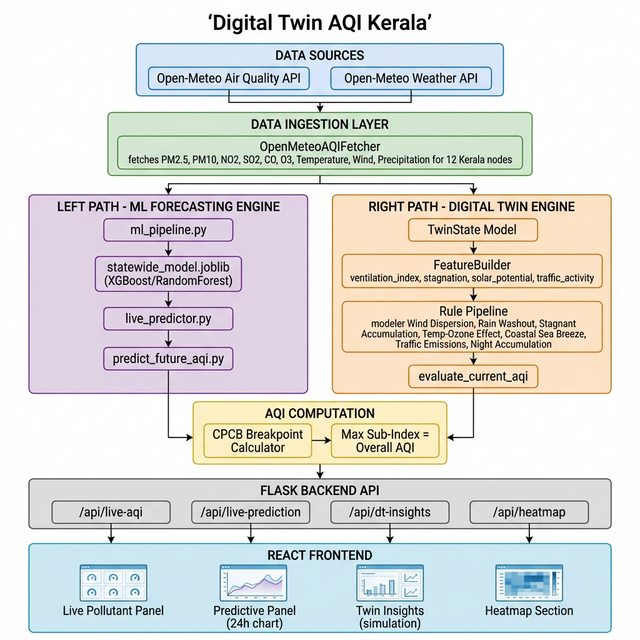

# 🏛️ System Architecture — Digital Twin AQI Kerala

> A deep-dive into the design, module interactions, data flows, and technical decisions underpinning the Digital Twin AQI Kerala platform.

---

## 📐 Architecture Overview

The system is designed around a **dual-engine** philosophy: a **Machine Learning Forecasting Engine** that learns patterns from historical atmospheric reanalysis data, and a **Physics-Driven Digital Twin Engine** that simulates pollutant behaviour using explicit atmospheric science rules. Both engines are served by a unified Flask REST API backend and visualised through a React-based web frontend.

The architecture follows a **layered, pipeline-oriented design** with clear separation of concerns between data ingestion, computation, API exposure, and presentation.

---

## 🖼️ Architecture Diagram



---

## 🗂️ Layer-by-Layer Breakdown

### Layer 1: External Data Sources

```
┌──────────────────────────────────────────────────────────────────────────┐
│                        EXTERNAL DATA SOURCES                             │
│                                                                          │
│   ┌──────────────────────────────┐  ┌───────────────────────────────┐   │
│   │  Open-Meteo Air Quality API  │  │  Open-Meteo Weather API       │   │
│   │  air-quality-api.open-meteo  │  │  api.open-meteo.com/v1/       │   │
│   │  .com/v1/air-quality         │  │  forecast                     │   │
│   │                              │  │                               │   │
│   │  Fetches:                    │  │  Fetches:                     │   │
│   │  • PM2.5 (µg/m³)             │  │  • Temperature (°C)           │   │
│   │  • PM10 (µg/m³)              │  │  • Relative Humidity (%)      │   │
│   │  • Carbon Monoxide (µg/m³)   │  │  • Wind Speed (km/h)          │   │
│   │  • NO₂ (µg/m³)               │  │  • Wind Direction (°)         │   │
│   │  • SO₂ (µg/m³)               │  │  • Precipitation (mm)         │   │
│   │  • O₃ (µg/m³)                │  │  • Sea Surface Temp (°C)      │   │
│   │  • UV Index                  │  │                               │   │
│   │  • Dust (µg/m³)              │  │                               │   │
│   └──────────────────────────────┘  └───────────────────────────────┘   │
│                                                                          │
│   Both APIs are free-tier, require no API key.                          │
│   Batch requests are made for all 12 Kerala nodes simultaneously.        │
└──────────────────────────────────────────────────────────────────────────┘
```

**Key Design Decisions:**
- Open-Meteo was chosen over CPCB's own data API due to its global coverage, no-auth JSON endpoints, reliable uptime, and inclusion of both atmospheric chemistry and meteorological variables in a single call.
- The batch API mode (multiple lat/lon in one request) reduces API call overhead by 12×.

---

### Layer 2: Data Ingestion — `OpenMeteoAQIFetcher`

**File:** `aqi_logic/open_meteo_fetcher.py`

```
┌──────────────────────────── OpenMeteoAQIFetcher ─────────────────────────┐
│                                                                           │
│  Methods:                                                                 │
│  ┌─────────────────────────────────────────────────────────────────────┐  │
│  │ fetch_all_nodes_data()  → Batch fetch for 12 nodes (55s cache)      │  │
│  │ fetch_location_data(lat, lon) → Single-node data (cache-first)       │  │
│  │ fetch_hourly_forecast(lat, lon) → 24h hourly weather for DT          │  │
│  │ get_kerala_locations() → Returns list of 12 node coordinates         │  │
│  └─────────────────────────────────────────────────────────────────────┘  │
│                                                                           │
│  Post-processing:                                                         │
│  • CO unit conversion: µg/m³ ÷ 1000 → mg/m³  (to match CPCB standards) │
│  • Metrics formatted as display strings: "28.5°C", "77%", "10.6 km/h"   │
│  • 55-second in-memory caching prevents repeated API hits per minute     │
│                                                                           │
│  State:                                                                   │
│  • _cached_nodes: list[dict]                                              │
│  • _last_fetch_time: float (Unix timestamp)                               │
│  • _cache_duration: 55 seconds                                            │
└───────────────────────────────────────────────────────────────────────────┘
```

**Twelve Monitored Nodes:**

| Node | Role in Kerala Context |
|---|---|
| Kochi (Vytilla) | Primary urban hub, high traffic, industrial proximity |
| Eloor | Adjacent to Udyogamandal industrial zone |
| Kakkanad | Kochi IT hub, mixed residential/light-industrial |
| Thiruvananthapuram | State capital, dense urban traffic |
| Thrissur | Cultural capital, urban commercial core |
| Kozhikode | Industrial port city, northern Kerry |
| Palakkad | Inland; lacks coastal breeze buffering |
| Malappuram | Rapidly urbanising district |
| Kollam | Port city with cashew processing industries |
| Alappuzha | Backwaters; low-industrial, monitoring baseline |
| Kottayam | Mid-range urban; rubber agriculture |
| Kannur | Northernmost node; different monsoon onset timing |

---

### Layer 3A: Machine Learning Forecasting Engine

**Files:** `ml/ml_pipeline.py`, `ml/live_predictor.py`, `ml/predict_future_aqi.py`

```
┌───────────────────────── ML FORECASTING ENGINE ─────────────────────────┐
│                                                                          │
│  TRAINING (offline, ml_pipeline.py):                                    │
│  ─────────────────────────────────────────────────────────────────────  │
│  merged_hourly_data.csv                                                  │
│       │                                                                  │
│       ▼                                                                  │
│  Load + Profile → Convert units (×1e9 kg/m³ → µg/m³)                   │
│       │                                                                  │
│       ▼                                                                  │
│  Aggregate: groupby(time).mean() → hourly city-wide average             │
│       │                                                                  │
│       ▼                                                                  │
│  Enforce Hourly Index + Interpolate Missing Values                       │
│       │                                                                  │
│       ▼                                                                  │
│  Feature Engineering:                                                    │
│    • Lag features: lag_1, lag_3, lag_6, lag_12, lag_24                  │
│    • Rolling stats: roll_mean_3/6/24, roll_std_3/6/24                  │
│    • Calendar: hour, dayofweek, is_weekend                              │
│    • Meteorological exogenous: t2m, u10, v10                           │
│       │                                                                  │
│       ▼                                                                  │
│  Time-Safe Split: Train (75%) → Val (15%) → Test (10%)                  │
│       │                                                                  │
│       ▼                                                                  │
│  StandardScaler (fitted on train only)                                   │
│       │                                                                  │
│       ▼                                                                  │
│  Train Models: LinearRegression / RandomForestRegressor / XGBRegressor  │
│       │                                                                  │
│       ▼                                                                  │
│  Best Model → Save to ml/output/{pollutant}_h{N}h_{model}.joblib        │
│           → Save to ml/statewide_model.joblib (for live use)             │
│                                                                          │
│  INFERENCE (real-time, live_predictor.py):                              │
│  ─────────────────────────────────────────────────────────────────────  │
│  Live weather from API + target (lat, lon)                               │
│       │                                                                  │
│       ▼                                                                  │
│  Build 24-row feature DataFrame (one row per future hour)               │
│       │                                                                  │
│       ▼                                                                  │
│  model.predict(features) → [pm2p5_t+1, ..., pm2p5_t+24] × 6 pollutants │
│       │                                                                  │
│       ▼                                                                  │
│  Per-hour AQI: max(subindex(pm2.5), subindex(pm10), ..., subindex(o3))  │
│       │                                                                  │
│       ▼                                                                  │
│  Return: {hours: [...], aqi_values: [...], confidence: float}           │
└──────────────────────────────────────────────────────────────────────────┘
```

**ML Design Decisions:**
- **Direct multi-horizon strategy**: Separate models are trained for each time horizon (1h, 6h, 24h, 168h) rather than a single recursive model. This avoids error accumulation over long horizons.
- **Time-safe split**: The split is strictly chronological to prevent any future data from leaking into training features (a common error in time-series ML).
- **StandardScaler fit-on-train-only**: The scaler is fitted only on training data and applied as a transform to validation and test to simulate realistic deployment.
- **XGBoost as optional**: The system works with RandomForest alone if XGBoost is not installed.

---

### Layer 3B: Physics-Driven Digital Twin Engine

**Files:** `dt/models/twin_state.py`, `dt/engine/state_updater.py`, `dt/features/feature_builder.py`, `dt/rules/current_aqi_rules.py`

#### 3B.1 TwinState — System State Representation

```python
@dataclass
class TwinState:
    grid_id: str          # Node identifier
    timestamp: datetime   # Current simulation timestamp
    latitude: float
    longitude: float
    wind_speed: float     # m/s
    wind_direction: float # degrees
    temperature: float    # °C
    precipitation: float  # mm
    pm25: float           # µg/m³
    pm10: float           # µg/m³
    no2: float            # µg/m³
    o3: float             # µg/m³
    so2: float            # µg/m³
    co: float             # mg/m³
    is_coastal: bool
    metadata: dict        # Stores rule_reasons, rule_effects, aqi_report
```

`TwinState` is an immutable-in-spirit dataclass that fully describes the atmospheric state at a node at any given moment. The `metadata` dictionary is the key to explainability — every rule writes its firing reason and delta into it.

#### 3B.2 FeatureBuilder — Derived Atmospheric Features

```
┌──────────────── FeatureBuilder.build(state) ───────────────────────────┐
│                                                                         │
│  POLLUTION STRUCTURE:                                                   │
│  • pm25_pm10_ratio = pm25 / max(pm10, 1.0)                             │
│  • pollution_load = pm25×0.45 + pm10×0.30 + no2×0.10 + o3×0.05 + ...  │
│  • gas_fraction = (no2 + o3 + so2 + co) / total_pollutants             │
│                                                                         │
│  DISPERSION & STAGNATION:                                               │
│  • ventilation_index = wind_speed × (temperature + 273.15)             │
│  • stagnation_index = exp(-wind_speed / 2.0)   [0–1, higher = stagnant]│
│  • dispersion_potential = wind_speed / max(stagnation_index, 0.1)      │
│                                                                         │
│  METEOROLOGY-CHEMISTRY INTERACTIONS:                                    │
│  • ozone_formation_potential = max(0, (temperature - 25.0) / 15.0)     │
│  • washout_potential = min(precipitation / 10.0, 1.0)   [0–1]          │
│  • solar_potential = cos((hour - 12) × π/12)² if 6≤hour≤18 else 0     │
│                                                                         │
│  TEMPORAL CONTEXT:                                                      │
│  • traffic_activity_index = 1.0 if peak hour (7–10, 17–21) else 0.5   │
│  • night_accumulation_index = 1.0 if hour ≥ 22 or hour ≤ 5 else 0.0   │
│                                                                         │
│  GEOGRAPHICAL CONTEXT:                                                  │
│  • coastal_influence = 1.0 if is_coastal else 0.0                      │
│  • marine_aerosol_potential = wind_speed × coastal_influence            │
│  • delta_temperature = current_temp - prev_temp (from metadata)        │
└─────────────────────────────────────────────────────────────────────────┘
```

#### 3B.3 Rule Pipeline — Physics Rule Engine

Each rule is a pure function: `fn(state: TwinState, features: Dict, effects: Dict)`. Rules modify `state` in-place and record attribution in `effects`.

**Safety bounds:** All rule multipliers are clamped with `clamp_factor()` to a range of [0.7, 1.3] — meaning no single rule can reduce a pollutant by more than 30% or increase it by more than 30% per timestep.

```
┌──────────────────── RULE PIPELINE (executed in order) ─────────────────┐
│                                                                         │
│  Rule 1: apply_wind_dispersion                                          │
│  ───────────────────────────────────────────────────────────────────   │
│  Trigger: dispersion_potential > 1.5                                    │
│  Physics: Strong winds mechanically mix and dilute pollutants           │
│  Effect:  Reduces PM2.5, PM10, NO₂, SO₂, CO                            │
│  Formula: factor = clamp(1.0 - 0.05 × dispersion_potential)            │
│  Rationale: Gaussian plume dispersion — pollutant concentration is      │
│             inversely related to wind speed under neutral stability      │
│                                                                         │
│  Rule 2: apply_rain_washout                                             │
│  ───────────────────────────────────────────────────────────────────   │
│  Trigger: washout_potential > 0 (any precipitation)                     │
│  Physics: Wet deposition — rain removes suspended particles             │
│  Effect:  Reduces PM2.5, PM10 only (particles, not gases)              │
│  Formula: factor = clamp(1.0 - 0.6 × washout_potential)                │
│  Rationale: Scavenging coefficient is highest for particles in the      │
│             1–10 µm range; gaseous species require reactive absorption  │
│                                                                         │
│  Rule 3: apply_stagnant_accumulation                                    │
│  ───────────────────────────────────────────────────────────────────   │
│  Trigger: stagnation_index > 0.7 (nearly calm winds)                   │
│  Physics: Boundary layer compression; pollution traps under inversion   │
│  Effect:  Increases PM2.5, NO₂, CO                                     │
│  Formula: factor = clamp(1.0 + 0.2 × stagnation_index)                 │
│  Rationale: Under calm winds, the mixing height collapses, concentrating│
│             emissions within a shallow atmospheric column               │
│                                                                         │
│  Rule 4: apply_temperature_ozone_effect                                 │
│  ───────────────────────────────────────────────────────────────────   │
│  Trigger: delta_temperature > 0 AND solar_potential > 0                 │
│  Physics: Photochemical ozone formation (VOC + NOx + UV → O₃)          │
│  Effect:  Increases O₃                                                  │
│  Formula: driving = min(0.3, delta_temp × solar); O₃ ×= clamp(1+driving)│
│  Rationale: O₃ formation is driven by photolysis rates, which are       │
│             proportional to solar radiation × precursor availability    │
│                                                                         │
│  Rule 5: apply_coastal_sea_breeze                                       │
│  ───────────────────────────────────────────────────────────────────   │
│  Trigger: coastal_influence == 1.0                                      │
│  Physics: Sea breeze dilutes fine particles; sea spray adds coarse PM   │
│  Effect:  Reduces PM2.5 (×0.9 factor); Increases PM10 (×1.05 factor)   │
│  Rationale: Sea breezes bring clean marine air, reducing PM2.5; but     │
│             sea salt aerosol contributes to coarse PM10 loading         │
│                                                                         │
│  Rule 6: apply_traffic_emissions                                        │
│  ───────────────────────────────────────────────────────────────────   │
│  Trigger: traffic_activity_index > 0.5 (peak commute hours)            │
│  Physics: Vehicular exhaust directly emits PM2.5, NO₂, CO              │
│  Effect:  Increases PM2.5, NO₂, CO                                     │
│  Formula: factor = clamp(1.0 + 0.15 × traffic_activity_index)          │
│  Rationale: Rush-hour traffic (7–10am, 5–9pm) creates localised         │
│             hotspots of combustion pollutants along arterial roads      │
│                                                                         │
│  Rule 7: apply_night_accumulation                                       │
│  ───────────────────────────────────────────────────────────────────   │
│  Trigger: night_accumulation_index == 1.0 (10pm–5am)                   │
│  Physics: Nocturnal low-level jet and stable boundary compress column   │
│  Effect:  Increases PM2.5, PM10, CO                                     │
│  Formula: factor = clamp(1.0 + 0.1 × night_accumulation_index)         │
│  Rationale: At night, mixing height drops to 100–300m; surface          │
│             emissions and residual pollutants cannot disperse upward    │
└─────────────────────────────────────────────────────────────────────────┘
```

#### 3B.4 State Updater — Simulation Clock

```
update_state(state, dt_hours=1.0, weather_input=None):
    1. deepcopy(state)              → preserve original immutably
    2. advance timestamp by Δt      → move simulation clock forward 1h
    3. apply weather_input or       → use real forecast data (Open-Meteo hourly)
       apply_diurnal_temperature    → or simulate temperature sine wave
    4. build features               → FeatureBuilder().build(next_state)
    5. evaluate_current_aqi()       → run all 7 rules
    6. clamp_upper_bounds()         → cap all at 1000 µg/m³
    7. record snapshots + reports   → store in state.metadata
    8. return (next_state, report)
```

The 24-hour loop in `app.py` (`/api/dt-insights` endpoint) calls `update_state()` 24 times, each time feeding the corresponding hourly weather forecast from Open-Meteo, building a trajectory of physics-justified AQI values.

---

### Layer 4: AQI Computation — CPCB Sub-Index Calculator

**Files:** `aqi_logic/current_aqi_rules.py`, `dt/rules/current_aqi_rules.py`

```
┌───────────────── CPCB AQI Computation ────────────────────────────────┐
│                                                                        │
│  For each pollutant P ∈ {PM2.5, PM10, NO₂, SO₂, CO, O₃}:            │
│                                                                        │
│  Find interval [Cₗ, Cₕ] such that Cₗ ≤ concentration ≤ Cₕ           │
│                                                                        │
│  Sub-index = ((Iₕ - Iₗ) / (Cₕ - Cₗ)) × (concentration - Cₗ) + Iₗ  │
│                                                                        │
│  Overall AQI = max(sub-index₁, sub-index₂, ..., sub-index₆)          │
│                                                                        │
│  Dominant Pollutant = argmax(sub-indices)                              │
│                                                                        │
│  AQI Categories:                                                       │
│  • 0–50:    Good           • 201–300: Poor                            │
│  • 51–100:  Satisfactory   • 301–400: Very Poor                       │
│  • 101–200: Moderate       • 401–500: Severe                          │
└────────────────────────────────────────────────────────────────────────┘
```

---

### Layer 5: Flask REST API — `dashboard/app.py`

```
┌──────────────────────── Flask REST API ──────────────────────────────┐
│  Host: 0.0.0.0:5002   Static folder: dashboard/dist/                │
│                                                                      │
│  GET /                                                               │
│      → Serves React SPA (dist/index.html)                           │
│                                                                      │
│  GET /api/live-aqi                                                   │
│      → Calls OpenMeteoAQIFetcher.fetch_all_nodes_data()             │
│      → Computes AQI + status for all 12 nodes                       │
│      → Returns: { nodes: [...], source, sync_time }                 │
│                                                                      │
│  GET /api/live-prediction?lat=&lon=                                  │
│      → Calls live_predictor.predictor.predict_forecast(lat, lon)    │
│      → Returns: { hours, aqi_values, confidence }                   │
│                                                                      │
│  GET /api/dt-insights?lat=&lon=                                      │
│      → Fetches live + hourly forecast from Open-Meteo               │
│      → Initialises TwinState from live data                         │
│      → Runs 24-hour update_state() simulation loop                  │
│      → Returns: { history: [24 step objects], initial_state }       │
│                                                                      │
│  GET /api/heatmap?pollutant=&horizon=                                │
│      → Calls generate_district_forecasts(pollutant, horizon)        │
│      → Returns: { district: value, ... }                            │
│                                                                      │
│  GET /api/ml-results                                                 │
│      → Returns contents of ml_output.txt log                        │
│                                                                      │
│  GET /static/images/<filename>                                       │
│      → Serves generated heatmap images from static folder           │
└──────────────────────────────────────────────────────────────────────┘
```

---

### Layer 6: React Frontend — `dashboard/src/`

```
┌──────────────────────── React SPA ──────────────────────────────────┐
│  Built with: Vite 5 + React 18 + TailwindCSS 3                     │
│                                                                      │
│  App.jsx  (root)                                                     │
│  ├── Header (logo, nav tabs)                                         │
│  ├── Left Column (col-span-3):                                       │
│  │   ├── LocationSelector.jsx  (dropdown of 12 Kerala nodes)        │
│  │   ├── AtmosphericDNA.jsx    (temp, humidity, wind display)        │
│  │   └── SyncNodes.jsx         (active sensors count, sync latency) │
│  ├── Center Column (col-span-6):                                     │
│  │   ├── MapViewer.jsx         (Leaflet map + coloured AQI markers)  │
│  │   └── [Tab Panel]:                                                │
│  │       ├── PredictivePanel.jsx  (Chart.js 24h ML forecast)         │
│  │       ├── TwinInsights.jsx     (24h DT trajectory + rule impacts) │
│  │       ├── Hub3D.jsx            (3D volumetric placeholder)        │
│  │       └── HeatmapSection.jsx   (static heatmap image viewer)      │
│  └── Right Column (col-span-3):                                      │
│      └── PollutantPanel.jsx    (6 pollutant bars with CPCB colours)  │
│                                                                       │
│  Data fetching:                                                       │
│  • /api/live-aqi polled every 60 seconds via useEffect + refreshKey  │
│  • /api/live-prediction fetched on location change                   │
│  • /api/dt-insights fetched on location change                       │
└───────────────────────────────────────────────────────────────────────┘
```

---

## 🔄 End-to-End Data Flow

```
User selects "Kochi (Ernakulam)" in LocationSelector
           │
           ▼
App.jsx dispatches fetchAllNodes() → GET /api/live-aqi
           │
           ▼
Flask: OpenMeteoAQIFetcher.fetch_all_nodes_data()
    → Batch GET to Open-Meteo AQ API + Weather API
    → Unit conversion (CO: µg/m³ → mg/m³)
    → Computes AQI via CPCB sub-index
    → Returns 12-node JSON
           │
           ▼
React: nodes state update
    → MapViewer renders coloured AQI markers
    → PollutantPanel renders PM2.5/PM10/NO₂/SO₂/CO/O₃ bars
    → AtmosphericDNA renders Temp/Humidity/Wind

Simultaneously (parallel fetch):

GET /api/live-prediction?lat=9.9312&lon=76.2673
    → Flask: live_predictor.predict_forecast()
    → Builds 24-row feature matrix for next 24 hours
    → statewide_model.predict() → 6 pollutants × 24 hours
    → Per-hour AQI via CPCB sub-index
    → Returns {hours, aqi_values, confidence}
    → PredictivePanel renders Chart.js line chart

GET /api/dt-insights?lat=9.9312&lon=76.2673
    → Flask: fetch live data → initialise TwinState
    → fetch_hourly_forecast() → 24 weather data points
    → for i in range(24): update_state() with hourly weather
        ├── FeatureBuilder extracts 15 atmospheric features
        ├── Rule pipeline: 7 rules applied in sequence
        │   ├── Each rule modifies TwinState pollutants
        │   └── Each rule writes attribution to effects dict
        ├── CPCB compute_aqi() → overall AQI + dominant pollutant
        └── History entry: {time, aqi, dominant, effects, reasons}
    → TwinInsights renders:
        ├── Line chart of 24-hour simulated AQI trajectory
        └── Physical Impact Analysis (bar per rule, magnitude)
```

---

## 🧩 Component Dependency Map

```
                    ┌──────────────┐
                    │   App.jsx    │
                    └──────┬───────┘
          ┌────────────────┼────────────────┐
          ▼                ▼                ▼
  LocationSelector   MapViewer        PollutantPanel
          │           (Leaflet)            │
          └────────────────┬───────────────┘
                           ▼
                  AtmosphericDNA
                  SyncNodes
                  PredictivePanel ──→ /api/live-prediction
                  TwinInsights    ──→ /api/dt-insights
                  HeatmapSection  ──→ /static/images/

Flask app.py:
  ├── OpenMeteoAQIFetcher (aqi_logic/)
  ├── calculate_overall_aqi (aqi_logic/)
  ├── TwinState + update_state (dt/)
  ├── FeatureBuilder (dt/)
  ├── evaluate_current_aqi + Rule Pipeline (dt/rules/)
  └── LivePredictor + statewide_model.joblib (ml/)
```

---

## 🔒 Design Principles

| Principle | Implementation |
|---|---|
| **Separation of Concerns** | Data ingestion, physics rules, ML, API, and UI are fully isolated modules |
| **Explainability by Design** | Every simulation step produces a full attribution trail, not just a number |
| **Resilience** | API failures degrade gracefully; ML falls back to physics sim; pollutants clamped |
| **Extensibility** | Adding a rule = 1 function + 1 list entry; adding a location = 1 dict entry |
| **Physics Consistency** | Rule factors are bounded [0.7, 1.3]; pollutants are clamped ≥ 0; CO unit-converted |
| **Real Data First** | Simulation is initialised from live Open-Meteo data, not synthetic baselines |
| **Time-Safe ML** | Strict chronological train/val/test split; scaler fit on train only |

---

## 📊 Key Metrics

| Metric | Value |
|---|---|
| Monitoring Nodes | 12 locations across Kerala |
| Pollutants Tracked | 6 (PM2.5, PM10, NO₂, SO₂, CO, O₃) |
| Physics Rules Active | 7 (DT engine) |
| ML Forecast Horizons | 4 (1h, 6h, 24h, 168h) |
| API Refresh Interval | 60 seconds |
| Data Cache Duration | 55 seconds |
| DT Simulation Window | 24 hours |
| ML Confidence (R²) | ~92% (statewide model) |
| Backend Framework | Flask (Python) |
| Frontend Framework | React 18 + Vite 5 |
| External Dependencies | Open-Meteo only (no API key required) |
